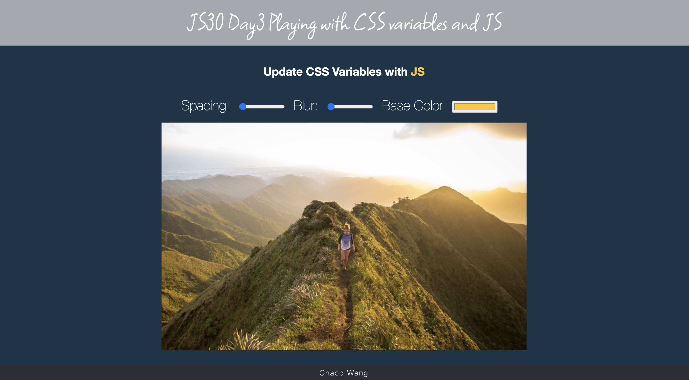

# JS30 Day3 - Playing with CSS variables and JS

Project Demo in [Pages](https://chacowang0125.github.io/js30_day3_css_variables/)


## Project setup
```
npm install
```

### Compiles and hot-reloads for development
```
npm run serve
```

### Compiles and minifies for production
```
npm run build
```

### Lints and fixes files
```
npm run lint
```

### Customize configuration
See [Configuration Reference](https://cli.vuejs.org/config/).
